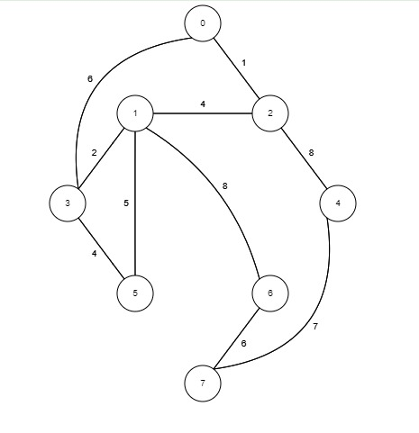
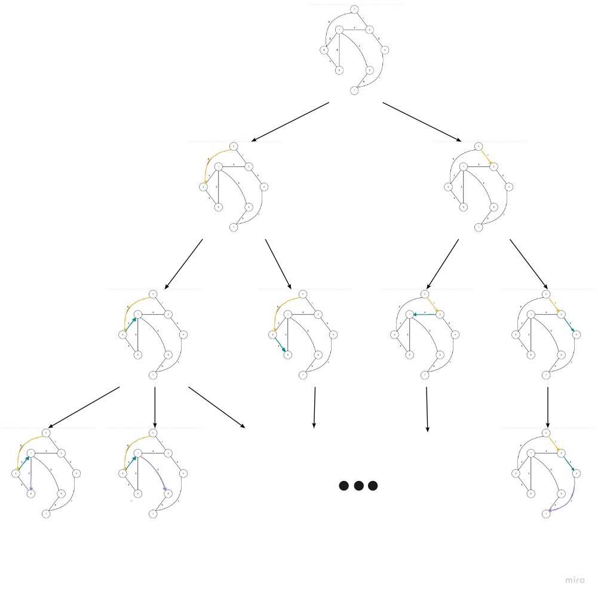

# Espacio de Búsqueda

## Estado Inicial
El estado inicial para el espacio de búsqueda de este problema se está considerando 100 puntos de distribución (almacenes) y 5000 puntos de entrega repartidos por toda la ciudad. Para poder representar el espacio de búsqueda se está utilizando el siguiente gráfico.

## Estado Final
El estado final del espacio de búsqueda se tiene que llegar a todos los puntos de entrega respetando los requerimientos de hacer menor distancia recorrida por combustible y con un menor tiempo posible.

## Espacio de Búsqueda

